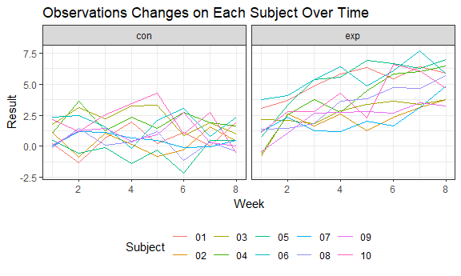
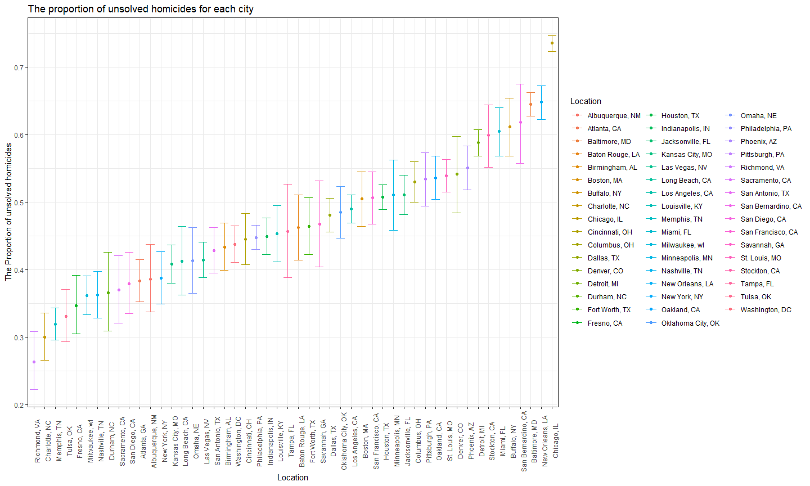

p8105\_hw5\_yw3095
================
Yixuan Wang
November 9, 2018

Problem 1
---------

This problem focused on data from all participants in a longitudinal study that included a control arm and an experimental arm.

``` r
read_csv_data = function(x) {
  read_csv(x) %>% 
    mutate(subject = x)
}

file_list = list.files("./data/") %>% paste0("./data/", .)

hw5 = map_dfr(file_list, read_csv_data) %>%
  separate(subject, into = c("remove1", "remove2", "subject"), sep = "\\/") %>% 
  separate(subject, into = c("arm", "subject"), sep = "_") %>%
  separate(subject, into = c("subject", "remove3"), sep = "\\.") %>%
  gather(key = week, value = result, week_1:week_8) %>% 
  separate(week, into = c("remove4", "week"), sep = "_") %>%
  mutate(week = as.numeric(week)) %>% 
  select(subject, arm, week, result) %>% 
  janitor::clean_names() 
```

``` r
ggplot(hw5, aes(x = week, y = result, color = subject)) + 
  geom_line() +
  facet_grid(. ~ arm) +
  labs(
    title = "Observations Changes on Each Subject Over Time",
    x = "Week",
    y = "Result",
    color = "Subject")
```



At week 1, control arm and exposure arm had the similar value of observations, which were about 1. The observations of subjects in control arm kept around value 1 over 8 weeks, while the observations of subjects in exposure arm increased over time from 1 to 5 roughly.

Problem 2
---------

This problem focus on data on homicides in 51 large U.S. cities.

``` r
raw_data = read_csv(file = "./data2/homicide.csv") 

homicide = raw_data %>% 
  mutate(city_state = paste(city, state, sep = ", ")) %>%
  janitor::clean_names() %>% 
  mutate(victim_race = as.factor(victim_race),
         victim_age = as.integer(victim_age),
         victim_sex = as.factor(victim_sex)) %>% 
  select(victim_race, victim_age, victim_sex, city_state, disposition) 
```

    ## Warning in evalq(as.integer(victim_age), <environment>): NAs introduced by
    ## coercion

``` r
skimr::skim(homicide)
```

    ## Skim summary statistics
    ##  n obs: 52179 
    ##  n variables: 5 
    ## 
    ## -- Variable type:character --------------------------------------------------------------------------------------------------------------
    ##     variable missing complete     n min max empty n_unique
    ##   city_state       0    52179 52179   9  18     0       51
    ##  disposition       0    52179 52179  14  21     0        3
    ## 
    ## -- Variable type:factor -----------------------------------------------------------------------------------------------------------------
    ##     variable missing complete     n n_unique
    ##  victim_race       0    52179 52179        6
    ##   victim_sex       0    52179 52179        3
    ##                                   top_counts ordered
    ##  Bla: 33361, His: 6901, Whi: 6333, Unk: 4199   FALSE
    ##      Mal: 40739, Fem: 7209, Unk: 4231, NA: 0   FALSE
    ## 
    ## -- Variable type:integer ----------------------------------------------------------------------------------------------------------------
    ##    variable missing complete     n mean    sd p0 p25 p50 p75 p100     hist
    ##  victim_age    2999    49180 52179 31.8 14.42  0  22  28  40  102 <U+2581><U+2587><U+2587><U+2583><U+2582><U+2581><U+2581><U+2581>

**Discription:**

There were 52179 observations and 12 variables in the homicide dataset. Each observation was a record of a homicide with the information of reported date, victim's name, race, age, sex, city, state, disposition and the longitude, latitude of the location. The key variables are the victims' race, age, sex, city\_state, and disposition. This dataset had the data on homicides in 51 large U.S. cities. There was no missing value in most variables but there were 2999 missing values in victim's age. Because compared to race and sex, victims' age was hard to confirm at the date the homicide was reported. The mean value of age was 31.8. There were 40739 male victims in this report, which were far more than 7209 female victims. The most ranks of victim's race were Black, Hispanic, and White.

``` r
summary = homicide %>% 
  group_by(city_state, disposition) %>% 
  summarize(num_homicide = n()) %>% 
  spread(key = disposition, value = num_homicide) %>%
  janitor::clean_names() 

summary[is.na(summary)] = 0

summary = summary %>% 
  mutate(total_homicide = closed_by_arrest + closed_without_arrest + open_no_arrest,
         unsolved_homicide = closed_without_arrest + open_no_arrest,
         total_homicide = as.numeric(total_homicide),
         unsolved_homicide = as.numeric(unsolved_homicide)) %>% 
  filter(total_homicide != 0 & unsolved_homicide != 0) %>% 
  select(city_state, total_homicide, unsolved_homicide) 
```

``` r
Bal_MD = summary %>% 
  filter(city_state == "Baltimore, MD") 

Bal_MD_prop = prop.test(Bal_MD$unsolved_homicide, Bal_MD$total_homicide, correct = TRUE)

save(Bal_MD_prop,file = "Bal_MD_prop.RData")

Bal_MD_prop %>% 
  broom::tidy() %>% 
    janitor::clean_names() %>% 
    select(estimate, conf_low, conf_high) %>% 
    knitr::kable(digits = 3) 
```

|  estimate|  conf\_low|  conf\_high|
|---------:|----------:|-----------:|
|     0.646|      0.628|       0.663|

``` r
prop_test = function(x){
  city_test = 
    summary %>% 
    filter(city_state == x)
  
  prop.test(city_test$unsolved_homicide, city_test$total_homicide) %>% 
    broom::tidy() %>% 
    janitor::clean_names() %>% 
    select(estimate, conf_low, conf_high)
}

city_prop = 
  tibble(city_state = summary$city_state) %>% 
  mutate(map(.x = summary$city_state, ~prop_test(.x))) %>% 
  unnest %>% 
  arrange(estimate)
```

``` r
city_plot = city_prop %>% 
  ggplot(aes(x = reorder(city_state, estimate), y = estimate, colour = city_state)) + 
  geom_point() +
  geom_errorbar(aes(ymin = conf_low, ymax = conf_high), width = 0.8) +
  labs(
    title = "The proportion of unsolved homicides for each city",
    x = "Location",
    y = "The Proportion of unsolved homicides",
    color = "Location"
  ) + 
  theme(legend.position = "right", axis.text.x = element_text(angle = 90))

city_plot
```

 **Discription:**

From the plot, we can found that Richmond, VA had the lowest proportion of unsolved homicides, which was 0.26. Chicago, IL had the highest proportion of unsolved homicides, which was 0.74. The proportion of unsolved homicides of Chicago was much higher than other cities. There was a gap between Chicago and New Orleans, LA, which had the secend highest proportion of unsolved homicides.
